<p align="right">English | <a href="">简体中文</a></p>

<p align="center">
  
  
  <h3 align="center"><strong>Robo3D: Towards Robust and Reliable 3D Perception against Common Corruptions</strong></h3>

  <p align="center">
      <a href="https://scholar.google.com/citations?user=-j1j7TkAAAAJ" target='_blank'>Lingdong Kong</a><sup> *</sup>,&nbsp;
      <a href="" target='_blank'>Youquan Liu</a><sup> *</sup>,&nbsp;
      <a href="" target='_blank'>Xin Li</a><sup> *</sup>,&nbsp;
      <a href="" target='_blank'>Runnan Chen</a>,&nbsp;
      <a href="" target='_blank'>Wenwei Zhang</a>,&nbsp;
      <a href="https://scholar.google.com/citations?user=YUKPVCoAAAAJ" target='_blank'>Jiawei Ren</a>,&nbsp;
      <a href="https://scholar.google.com/citations?user=lSDISOcAAAAJ" target='_blank'>Liang Pan</a>,&nbsp;
      <a href="" target='_blank'>Kai Chen</a>,&nbsp;
      <a href="https://scholar.google.com/citations?user=lc45xlcAAAAJ" target='_blank'>Ziwei Liu</a>
    <br>
  
  </p>

</p>

<p align="center">
  <a href="" target='_blank'>
    
  </a>
  
  <a href="" target='_blank'>
    
  </a>
  
  <a href="" target='_blank'>
    
  </a>
  
  <a href="" target='_blank'>
    
  </a>
</p>


## About
`Robo3D` is an evaluation benchmark heading toward robust and reliable 3D perception in autonomous driving. With it, we probe the **robustness** of 3D **detectors** and **segmentors** under out-of-distribution (OoD) scenarios against **corruptions** that occur in the real-world environment. Specifically, we consider natural corruptions happen in the following cases:
1. **Adversarial weather conditions**, such as `fog`, `wet ground`, and `snow`;
2. **External disturbances** that are caused by `motion blur` or result in LiDAR `beam missing`;
3. **Internal sensor failure**, including `crosstalk`, possible `incomplete echo`, and `cross-sensor` scenarios.

| | | |
| :---: | :---: | :---: |
| 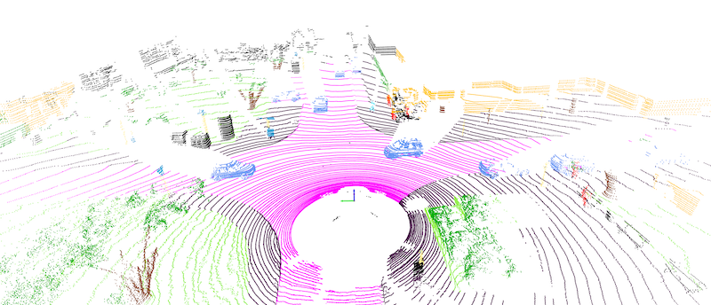 | 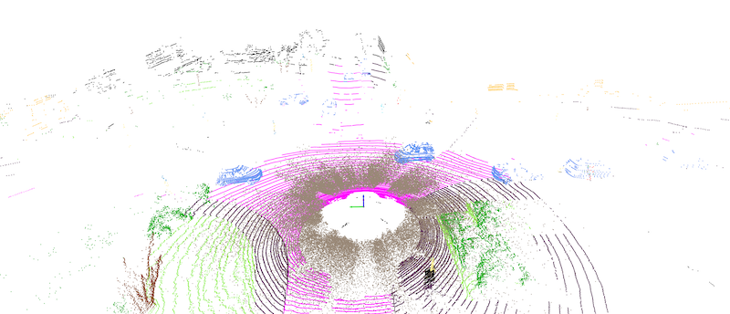 | 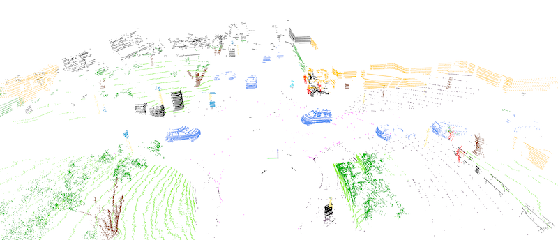 |
| **Clean** | **Fog** | **Wet Ground** |
| 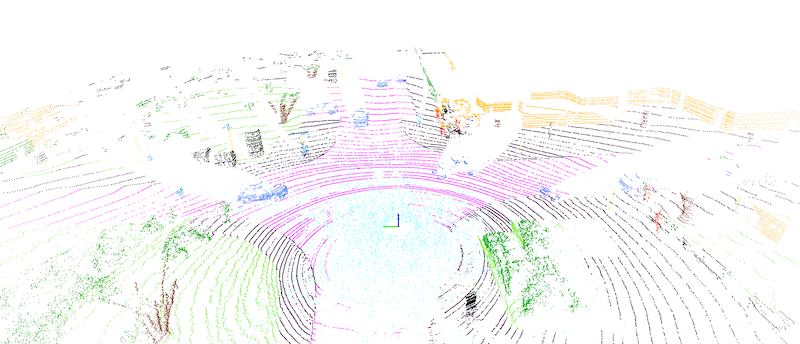 | 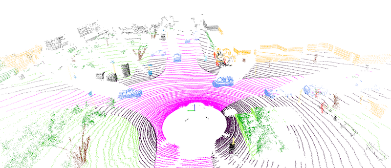 | 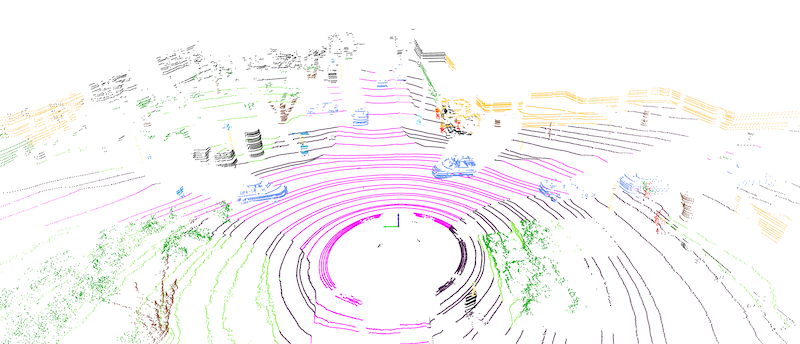
| **Snow** | **Motion Blur** | **Beam Missing** |
|  | 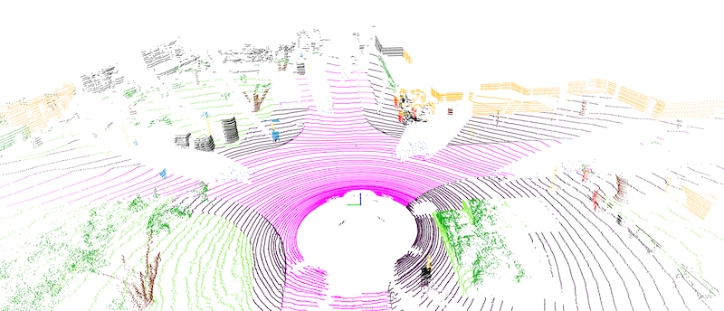 | 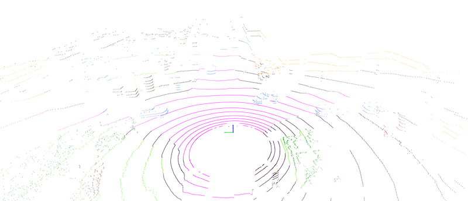 | 
| **Crosstalk** | **Incomplete Echo** | **Cross-Sensor** |
| | | |

Visit our [project page]() to explore more examples. :oncoming_automobile:


## Updates
- [2023.01] - Launch of the `Robo3D` benchmark. In this initial version, we include **7** detectors (**12** variants) and **17** segmentors (**22** variants) in total, evaluated on **4** large-scale autonomous driving datasets (KITTI, SemanticKITTI, nuScenes, and Waymo Open) with **8** corruption types across **3** severity levels.


## Outline
- [Installation](#installation)
- [Data Preparation](#data-preparation)
- [Getting Started](#getting-started)
- [Taxonomy](#taxonomy)
- [Model Zoo](#model-zoo)
- [Benchmark](#benchmark)
- [Create Corruption Set](#create-corruption-set)
- [TODO List](#todo-list)
- [Citation](#citation)
- [License](#license)
- [Acknowledgements](#acknowledgements)


## Installation
For details related to installation, kindly refer to [INSTALL.md](docs/INSTALL.md).


## Data Preparation

Kindly refer to [DATA_PREPARE.md](docs/DATA_PREPARE.md) for the details to prepare the <sup>1</sup>`KITTI`, <sup>2</sup>`KITTI-C`, <sup>3</sup>`SemanticKITTI`, <sup>4</sup>`SemanticKITTI-C`, <sup>5</sup>`nuScenes`, <sup>6</sup>`nuScenes-C`, <sup>7</sup>`WaymoOpen`, and <sup>8</sup>`WaymoOpen-C` datasets.


## Getting Started

To learn more usage about this codebase, kindly refer to [GET_STARTED.md](docs/GET_STARTED.md).


## Taxonomy
To be updated.


## Model Zoo

<details open>
<summary>&nbsp<b>LiDAR Semantic Segmentation</b></summary>

> - [x] **[SqueezeSeg](https://arxiv.org/abs/1710.07368), ICRA 2018.** <sup>[**`[Code]`**](https://github.com/BichenWuUCB/SqueezeSeg)</sup>
> - [x] **[SqueezeSegV2](https://arxiv.org/abs/1809.08495), ICRA 2019.** <sup>[**`[Code]`**](https://github.com/xuanyuzhou98/SqueezeSegV2)</sup>
> - [x] **[MinkowskiNet](https://arxiv.org/abs/1904.08755), CVPR 2019.** <sup>[**`[Code]`**](https://github.com/NVIDIA/MinkowskiEngine)</sup>
> - [x] **[RangeNet++](https://www.ipb.uni-bonn.de/wp-content/papercite-data/pdf/milioto2019iros.pdf), IROS 2019.** <sup>[**`[Code]`**](https://github.com/PRBonn/lidar-bonnetal)</sup>
> - [x] **[KPConv](https://arxiv.org/abs/1904.08889), ICCV 2019.** <sup>[**`[Code]`**](https://github.com/HuguesTHOMAS/KPConv)</sup>
> - [x] **[SalsaNext](https://arxiv.org/abs/2003.03653), ISVC 2020.** <sup>[**`[Code]`**](https://github.com/TiagoCortinhal/SalsaNext)</sup>
> - [ ] **[RandLA-Net](https://arxiv.org/abs/1911.11236), CVPR 2020.** <sup>[**`[Code]`**](https://github.com/QingyongHu/RandLA-Net)</sup>
> - [x] **[PolarNet](https://arxiv.org/abs/2003.14032), CVPR 2020.** <sup>[**`[Code]`**](https://github.com/edwardzhou130/PolarSeg)</sup>
> - [ ] **[3D-MiniNet](https://arxiv.org/abs/2002.10893), IROS 2020.** <sup>[**`[Code]`**](https://github.com/Shathe/3D-MiniNet)</sup>
> - [x] **[SPVCNN](https://arxiv.org/abs/2007.16100), ECCV 2020.** <sup>[**`[Code]`**](https://github.com/mit-han-lab/spvnas)</sup>
> - [x] **[Cylinder3D](https://arxiv.org/abs/2011.10033), CVPR 2021.** <sup>[**`[Code]`**](https://github.com/xinge008/Cylinder3D)</sup>
> - [x] **[FIDNet](https://arxiv.org/abs/2109.03787), IROS 2021.** <sup>[**`[Code]`**](https://github.com/placeforyiming/IROS21-FIDNet-SemanticKITTI)</sup>
> - [x] **[RPVNet](https://arxiv.org/abs/2103.12978), ICCV 2021.**
> - [x] **[CENet](https://arxiv.org/abs/2207.12691), ICME 2022.** <sup>[**`[Code]`**](https://github.com/huixiancheng/CENet)</sup>
> - [x] **[CPGNet](https://arxiv.org/abs/2204.09914), ICRA 2022.** <sup>[**`[Code]`**](https://github.com/GangZhang842/CPGNet)</sup>
> - [x] **[2DPASS](https://arxiv.org/abs/2207.04397), ECCV 2022.** <sup>[**`[Code]`**](https://github.com/yanx27/2DPASS)</sup>
> - [x] **[GFNet](https://arxiv.org/abs/2207.02605), TMLR 2022.** <sup>[**`[Code]`**](https://github.com/haibo-qiu/GFNet)</sup>
> - [ ] **[PCB-RandNet](https://arxiv.org/abs/2209.13797), arXiv 2022.** <sup>[**`[Code]`**](https://github.com/huixiancheng/PCB-RandNet)</sup>
> - [x] **[PIDS](https://arxiv.org/abs/2211.15759), WACV 2023.** <sup>[**`[Code]`**](https://github.com/lordzth666/WACV23_PIDS-Joint-Point-Interaction-Dimension-Search-for-3D-Point-Cloud)</sup>
> - [x] **[WaffleIron](http://arxiv.org/abs/2301.10100), arXiv 2023.** <sup>[**`[Code]`**](https://github.com/valeoai/WaffleIron)</sup>

</details>


<details open>
<summary>&nbsp<b>3D Object Detection</b></summary>

> - [x] **[SECOND](https://www.mdpi.com/1424-8220/18/10/3337), Sensors 2018.** <sup>[**`[Code]`**](https://github.com/traveller59/second.pytorch)</sup>
> - [x] **[PointPillars](https://arxiv.org/abs/1812.05784), CVPR 2019.** <sup>[**`[Code]`**](https://github.com/nutonomy/second.pytorch)</sup>
> - [x] **[PointRCNN](https://arxiv.org/abs/1812.04244), CVPR 2019.** <sup>[**`[Code]`**](https://github.com/sshaoshuai/PointRCNN)</sup>
> - [x] **[Part-A2](https://arxiv.org/abs/1907.03670), TPAMI 2020.**
> - [x] **[PV-RCNN](https://arxiv.org/abs/1912.13192), CVPR 2020.** <sup>[**`[Code]`**](https://github.com/sshaoshuai/PV-RCNN)</sup>
> - [x] **[CenterPoint](https://arxiv.org/abs/2006.11275), CVPR 2021.** <sup>[**`[Code]`**](https://github.com/tianweiy/CenterPoint)</sup>
> - [x] **[PV-RCNN++](https://arxiv.org/abs/2102.00463), IJCV 2022.** <sup>[**`[Code]`**](https://github.com/open-mmlab/OpenPCDet)</sup>

</details>


## Benchmark

### LiDAR Semantic Segmentation

The *mean Intersection-over-Union (mIoU)* is consistently used as the main indicator for evaluating model performance in our  LiDAR semantic segmentation benchmark. The following two metrics are adopted to compare between models' robustness:
- **mCE (the lower the better):** The *average corruption error* (in percentage) of a candidate model compared to the baseline model, which is calculated among all corruption types across three severity levels.
- **mRR (the higher the better):** The *average resilience rate* (in percentage) of a candidate model compared to its "clean" performance, which is calculated among all corruption types across three severity levels.


### :red_car:&nbsp; SemanticKITTI-C

<p align="center">
  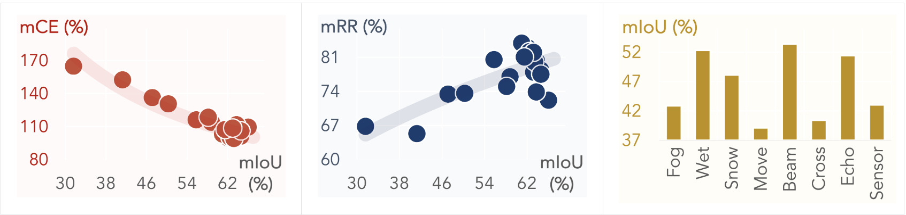
</p>

| Model | mCE (%) | mRR (%) | Clean | Fog | Wet Ground | Snow | Motion Blur | Beam Missing | Cross-Talk | Incomplete Echo | Cross-Sensor |
| -: | :-: | :-: | :-: | :-: | :-: | :-: | :-: | :-: | :-: | :-: | :-: |
| [SqueezeSeg](docs/results/SqueezeSeg.md) | 164.87 | 66.81 | 31.61 | 18.85 | 27.30 | 22.70 | 17.93 | 25.01 | 21.65 | 27.66 | 7.85 |
| [SqueezeSegV2](docs/results/SqueezeSegV2.md) | 152.45 | 65.29 | 41.28 | 25.64 | 35.02 | 27.75 | 22.75 | 32.19 | 26.68 | 33.80 | 11.78 |
| [RangeNet<sub>21</sub>](docs/results/RangeNet-dark21.md) | 136.33 | 73.42 | 47.15 | 31.04 | 40.88 | 37.43 | 31.16 | 38.16 | 37.98 | 41.54 | 18.76 |
| [RangeNet<sub>53</sub>](docs/results/RangeNet-dark21.md) | 130.66 | 73.59 | 50.29 | 36.33 | 43.07 | 40.02 | 30.10 | 40.80 | 46.08 | 42.67 | 16.98 |
| [SalsaNext](docs/results/SalsaNext.md) | 116.14 | 80.51 | 55.80 | 34.89 | 48.44 | 45.55 | 47.93 | 49.63 | 40.21 | 48.03 | 44.72 |
| [FIDNet<sub>34</sub>](docs/results/FIDNet.md) | 113.81 | 76.99 | 58.80 | 43.66 | 51.63 | 49.68 | 40.38 | 49.32 | 49.46 | 48.17 | 29.85 |
| [CENet<sub>34</sub>](docs/results/CENet.md) | 103.41 | 81.29 | 62.55 | 42.70 | 57.34 | 53.64 | 52.71 | 55.78 | 45.37 | 53.40 | 45.84 |
| |
| [KPConv](docs/results/KPConv.md) | 99.54 | 82.90 | 62.17 | 54.46 | 57.70 | 54.15 | 25.70 | 57.35 | 53.38 | 55.64 | 53.91 |
| [PIDS<sub>NAS1.25x</sub>]() | 104.13 | 77.94 | 63.25 | 47.90 | 54.48 | 48.86 | 22.97 | 54.93 | 56.70 | 55.81 | 52.72 |
| [PIDS<sub>NAS2.0x</sub>]()  | 101.20 | 78.42 | 64.55 | 51.19 | 55.97 | 51.11 | 22.49 | 56.95 | 57.41 | 55.55 | 54.27 |
| [WaffleIron](docs/results/WaffleIron.md) | 109.54 | 72.18 | 66.04 | 45.52 | 58.55 | 49.30 | 33.02 | 59.28 | 22.48 | 58.55 | 54.62 |
| |
| [PolarNet](docs/results/PolarNet.md) | 118.56 | 74.98 | 58.17 | 38.74 | 50.73 | 49.42 | 41.77 | 54.10 | 25.79 | 48.96 | 39.44 |
| |
| <sup>:star:</sup>[MinkUNet<sub>18</sub>](docs/results/MinkUNet-18_cr1.0.md) | 100.00 | 81.90 | 62.76 | 55.87 | 53.99 | 53.28 | 32.92 | 56.32 | 58.34 | 54.43 | 46.05 |
| [MinkUNet<sub>34</sub>](docs/results/MinkUNet-34_cr1.6.md) | 100.61 | 80.22 | 63.78 | 53.54 | 54.27 | 50.17 | 33.80 | 57.35 | 58.38 | 54.88 | 46.95 |
| [Cylinder3D<sub>SPC</sub>](docs/results/Cylinder3D.md) | 103.25 | 80.08 | 63.42 | 37.10 | 57.45 | 46.94  | 52.45 | 57.64 | 55.98 | 52.51 | 46.22 |
| [Cylinder3D<sub>TSC</sub>](docs/results/Cylinder3D-TS.md) | 103.13 | 83.90 | 61.00 | 37.11 | 53.40 | 45.39 | 58.64 | 56.81 | 53.59 | 54.88 | 49.62 |
| |
| [SPVCNN<sub>18</sub>](docs/results/SPVCNN-18_cr1.0.md) | 100.30 | 82.15 | 62.47 | 55.32 | 53.98 | 51.42 | 34.53 | 56.67 | 58.10 | 54.60 | 45.95 |
| [SPVCNN<sub>34</sub>](docs/results/SPVCNN-34_cr1.6.md) | 99.16 | 82.01 | 63.22 | 56.53 | 53.68 | 52.35 | 34.39 | 56.76 | 59.00 | 54.97 | 47.07 |
| [RPVNet](docs/results/RPVNet.md) | 111.74 | 73.86 | 63.75 | 47.64 | 53.54 | 51.13 | 47.29 | 53.51 | 22.64 | 54.79 | 46.17 |
| [CPGNet]() | 107.34 | 81.05 | 61.50 | 37.79 | 57.39 | 51.26 | 59.05 | 60.29 | 18.50 | 56.72 | 57.79 |
| [2DPASS](docs/results/DPASS.md) | 106.14 | 77.50 | 64.61 | 40.46 | 60.68 | 48.53 | 57.80 | 58.78 | 28.46 | 55.84 | 50.01 |
| [GFNet](docs/results/GFNet.md) | 108.68 | 77.92 | 63.00 | 42.04 | 56.57 | 56.71 | 58.59 | 56.95 | 17.14 | 55.23 | 49.48 |

**Note:** Symbol <sup>:star:</sup> denotes the baseline model adopted in *mCE* calculation.


### :blue_car:&nbsp; nuScenes-C

<p align="center">
  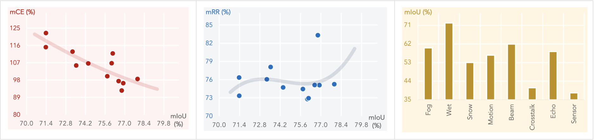
</p>

| Model | mCE (%) | mRR (%) | Clean | Fog | Wet Ground | Snow | Motion Blur | Beam Missing | Cross-Talk | Incomplete Echo | Cross-Sensor |
| -: | :-: | :-: | :-: | :-: | :-: | :-: | :-: | :-: | :-: | :-: | :-: |
| [FIDNet<sub>34</sub>](docs/results/FIDNet.md) | 122.42 | 73.33 | 71.38 | 64.80 | 68.02 | 58.97 | 48.90 | 48.14 | 57.45 | 48.76 | 23.70 | 
| [CENet<sub>34</sub>](docs/results/CENet.md) | 112.79 | 76.04 | 73.28 | 67.01 | 69.87 | 61.64 | 58.31 | 49.97 | 60.89 | 53.31 | 24.78 |
| |
| [WaffleIron](docs/results/WaffleIron.md) | 106.73 | 72.78 | 76.07 | 56.07 | 73.93 | 49.59 | 59.46 | 65.19 | 33.12 | 61.51 | 44.01 |
| |
| [PolarNet](docs/results/PolarNet.md) | 115.09 | 76.34 | 71.37 | 58.23 | 69.91 | 64.82 | 44.60 | 61.91 | 40.77 | 53.64 | 42.01 |
| |
| <sup>:star:</sup>[MinkUNet<sub>18</sub>](docs/results/MinkUNet-18_cr1.0.md) | 100.00 | 74.44 | 75.76 | 53.64 | 73.91 | 40.35 | 73.39 | 68.54 | 26.58 | 63.83 | 50.95 |
| [MinkUNet<sub>34</sub>](docs/results/MinkUNet-34_cr1.6.md) | 96.37 | 75.08 | 76.90 | 56.91 | 74.93 | 37.50 | 75.24 | 70.10 | 29.32 | 64.96 | 52.96 |
| [Cylinder3D<sub>SPC</sub>](docs/results/Cylinder3D.md) | 111.84 | 72.94 | 76.15 | 59.85 | 72.69 | 58.07 | 42.13 | 64.45 | 44.44 | 60.50 | 42.23 |
| [Cylinder3D<sub>TSC</sub>](docs/results/Cylinder3D-TS.md) | 105.56 | 78.08 | 73.54 | 61.42 | 71.02 | 58.40 | 56.02 | 64.15 | 45.36 | 59.97 | 43.03 |
| |
| [SPVCNN<sub>18</sub>](docs/results/SPVCNN-18_cr1.0.md) | 106.65 | 74.70 | 74.40 | 59.01 | 72.46 | 41.08 | 58.36 | 65.36 | 36.83 | 62.29 | 49.21 |
| [SPVCNN<sub>34</sub>](docs/results/SPVCNN-34_cr1.6.md) | 97.45 | 75.10 | 76.57 | 55.86 | 74.04 | 41.95 | 74.63 | 68.94 | 28.11 | 64.96 | 51.57 |
| [2DPASS](docs/results/DPASS.md) | 98.56 | 75.24 | 77.92 | 64.50 | 76.76 | 54.46 | 62.04 | 67.84 | 34.37 | 63.19 | 45.83 |
| [GFNet](docs/results/GFNet.md) | 92.55 | 83.31 | 76.79 | 69.59 | 75.52 | 71.83 | 59.43 | 64.47 | 66.78 | 61.86 | 42.30 |

**Note:** Symbol <sup>:star:</sup> denotes the baseline model adopted in *mCE* calculation.


### :taxi:&nbsp; WaymoOpen-C

| Model | mCE (%) | mRR (%) | Clean  | Fog | Wet Ground | Snow | Motion Blur | Beam Missing | Cross-Talk | Incomplete Echo | Cross-Sensor |
| -: | :-: | :-: | :-: | :-: | :-: | :-: | :-: | :-: | :-: | :-: | :-: |
| <sup>:star:</sup>[MinkUNet<sub>18</sub>](docs/results/MinkUNet-18_cr1.0.md) | 100.00 |  | 69.06 |
| [MinkUNet<sub>34</sub>](docs/results/MinkUNet-34_cr1.6.md) |  |  | 70.15 | 
| [Cylinder3D<sub>TSC</sub>](docs/results/Cylinder3D-TS.md) |  |  | 65.93 |
| |
| [SPVCNN<sub>18</sub>](docs/results/SPVCNN-18_cr1.0.md) |  |  | 67.35 |
| [SPVCNN<sub>34</sub>](docs/results/SPVCNN-34_cr1.6.md) |  |  | 69.01 | 

**Note:** Symbol <sup>:star:</sup> denotes the baseline model adopted in *mCE* calculation.


### 3D Object Detection

The *mean average precision (mAP)* and *nuScenes detection score (NDS)* are consistently used as the main indicator for evaluating model performance in our  LiDAR semantic segmentation benchmark. The following two metrics are adopted to compare between models' robustness:
- **mCE (the lower the better):** The *average corruption error* (in percentage) of a candidate model compared to the baseline model, which is calculated among all corruption types across three severity levels.
- **mRR (the higher the better):** The *average resilience rate* (in percentage) of a candidate model compared to its "clean" performance, which is calculated among all corruption types across three severity levels.


### :red_car:&nbsp; KITTI-C

<p align="center">
  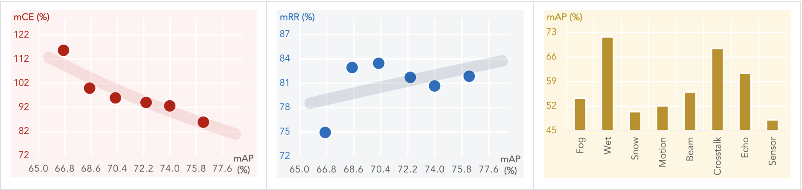
</p>

| Model | mCE (%) | mRR (%) | Clean  | Fog | Wet Ground | Snow | Motion Blur | Beam Missing | Cross-Talk | Incomplete Echo | Cross-Sensor |
| -: | :-: | :-: | :-: | :-: | :-: | :-: | :-: | :-: | :-: | :-: | :-: |
| [PointPillars]() | 115.69 | 74.94 | 66.70 | 45.70 | 66.71 | 35.77 | 47.09 | 52.24 | 60.01 | 54.84 | 37.50 |
| <sup>:star:</sup>[SECOND]() | 100.00 | 82.94 | 68.49 | 53.24 | 68.51 | 54.92 | 49.19 | 54.14 | 67.19 | 59.25 | 48.00 |
| [PointRCNN]() | 95.97 | 83.46 | 70.26 | 56.31 | 71.82 | 50.20 | 51.52 | 56.84 | 65.70 | 62.02 | 54.73 |
| [PartA2<sub>Free</sub>]() | 85.87 | 81.87 | 76.28 | 58.06 | 76.29 | 58.17 | 55.15 | 59.46 | 75.59 | 65.66 | 51.22 |
| [PartA2<sub>Anchor</sub>]() | 92.64 | 80.67 | 73.98 | 56.59 | 73.97 | 51.32 | 55.04 | 56.38 | 71.72 | 63.29 | 49.15 |
| [PVRCNN]() | 94.06 | 81.73 | 72.36 | 55.36 | 72.89 | 52.12 | 54.44 | 56.88 | 70.39 | 63.00 | 48.01 |

**Note:** Symbol <sup>:star:</sup> denotes the baseline model adopted in *mCE* calculation.


### :blue_car:&nbsp; nuScenes-C

<p align="center">
  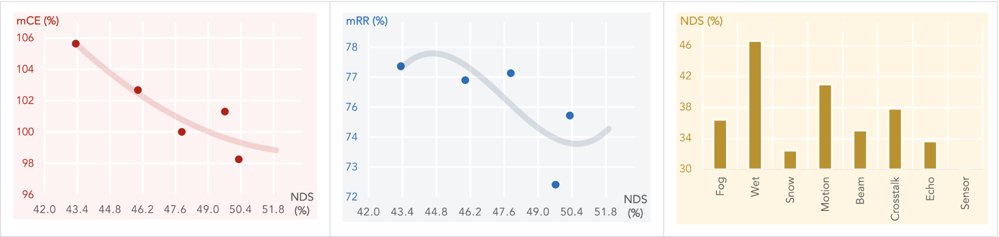
</p>

| Model | mCE (%) | mRR (%) | Clean  | Fog | Wet Ground | Snow | Motion Blur | Beam Missing | Cross-Talk | Incomplete Echo | Cross-Sensor |
| -: | :-: | :-: | :-: | :-: | :-: | :-: | :-: | :-: | :-: | :-: | :-: |
| [PointPillars<sub>MH</sub>]() | 105.63 | 77.24 | 43.33 | 33.16 | 42.92 | 29.49 | 38.04 | 33.61 | 34.61 | 30.90 | 25.00 |
| <sup>:star:</sup>[SECOND<sub>MH</sub>]() | 100.00 | 76.96 | 47.87 | 38.00 | 47.59 | 33.92 | 41.32 | 35.64 | 40.30 | 34.12 | 23.82 |
| [CenterPoint<sub>PP</sub>]() | 102.67 | 76.68 | 45.99 | 35.01 | 45.41 | 31.23 | 41.79 | 35.16 | 35.22 | 32.53 | 25.78 |
| [CenterPoint<sub>LR</sub>]() | 101.29 | 72.49 | 49.72 | 36.39 | 47.34 | 32.81 | 40.54 | 34.47 | 38.11 | 35.50 | 23.16 |
| [CenterPoint<sub>HR</sub>]() | 98.25 | 75.26 | 50.31 | 39.55 | 49.77 | 34.73 | 43.21 | 36.21 | 40.98 | 35.09 | 23.38 |

**Note:** Symbol <sup>:star:</sup> denotes the baseline model adopted in *mCE* calculation.


### :taxi:&nbsp; WaymoOpen-C

| Model | mCE (%) | mRR (%) | Clean  | Fog | Wet Ground | Snow | Motion Blur | Beam Missing | Cross-Talk | Incomplete Echo | Cross-Sensor |
| -: | :-: | :-: | :-: | :-: | :-: | :-: | :-: | :-: | :-: | :-: | :-: |
| [PointPillars]() | | | 
| <sup>:star:</sup>[SECOND]() | 100.00 | | 
| [CenterPoint]() | 
| [PVRCNN]() | 
| [PVRCNN++]() | 

**Note:** Symbol <sup>:star:</sup> denotes the baseline model adopted in *mCE* calculation.


### :vertical_traffic_light: More Benchmarking Results

For more detailed experimental results and visual comparisons, please refer to [RESULTS.md](docs/RESULTS.md).


## Create Corruption Set
You can manage to create your own "RoboDet" corrpution sets on other LiDAR-based point cloud datasets using our defined corruption types! Follow the instructions listed in [CREATE.md](docs/CREATE.md).


## TODO List
- [x] Initial release. 🚀
- [ ] Add scripts for creating common corruptions.
- [ ] Add download links for corruption sets.
- [ ] Add evaluation scripts on corruption sets.
- [ ] Release checkpoints.
- [ ] ...


## Citation
If you find this work helpful, please kindly consider citing our paper:

```bibtex
@ARTICLE{robo3d,
  title={Robo3D: Towards Robust and Reliable 3D Perception against Common Corruptions},
  author={xxx},
  journal={arXiv preprint arXiv:23xx.xxxxx}, 
  year={2023},
}
```


## License
<a rel="license" href="http://creativecommons.org/licenses/by-nc-sa/4.0/"></a>
<br />
This work is under the <a rel="license" href="http://creativecommons.org/licenses/by-nc-sa/4.0/">Creative Commons Attribution-NonCommercial-ShareAlike 4.0 International License</a>, while some specific operations in this codebase might be with other licenses. Please refer to [LICENSE.md](docs/LICENSE.md) for a more careful check, if you are using our code for commercial matters.


## Acknowledgements
To be updated.


