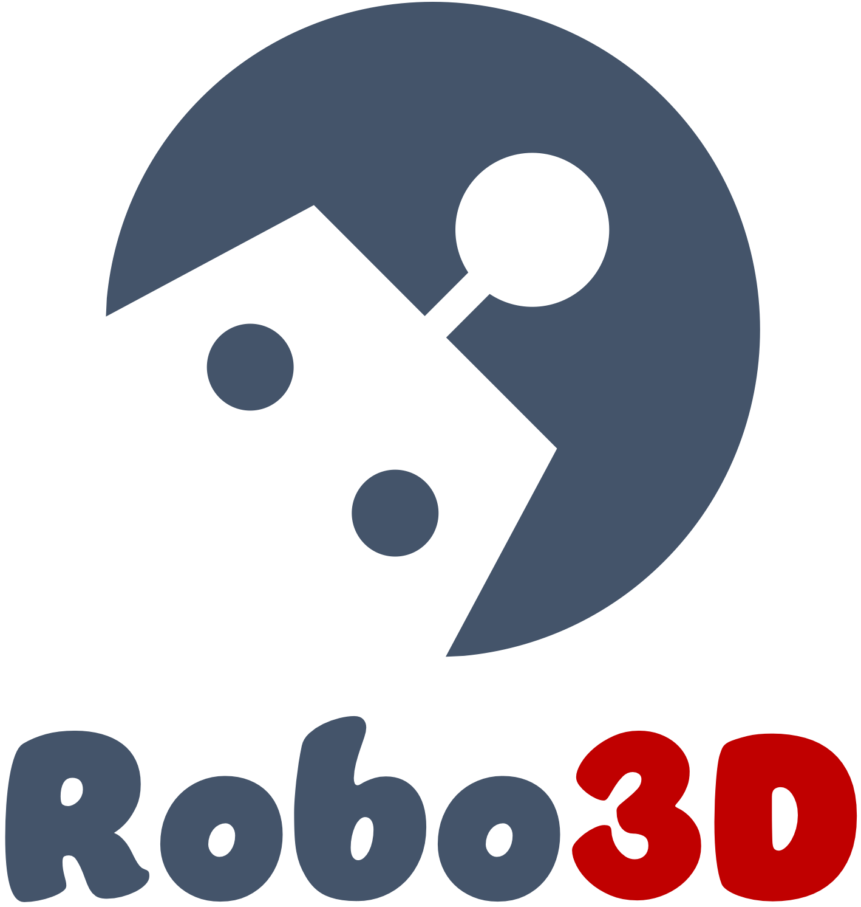
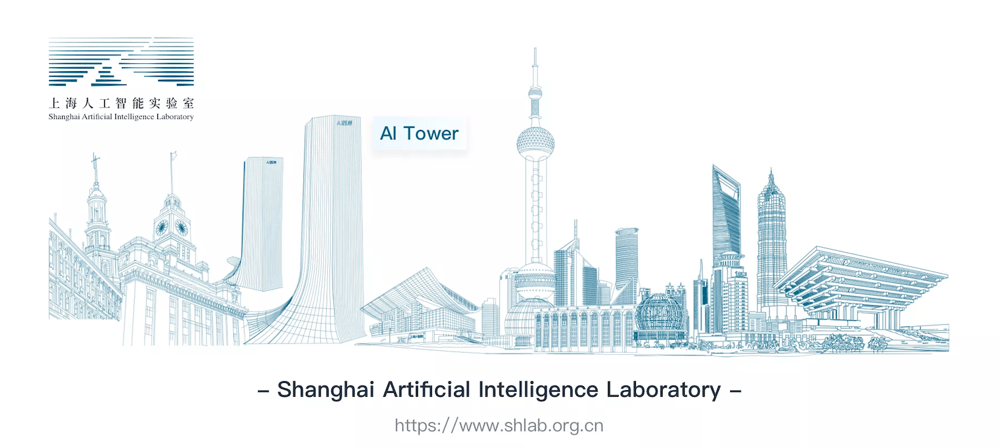

<br />
<p align="center">
  
  
  <h3 align="center"><strong>Robo3D: Towards Robust and Reliable 3D Perception against Corruptions</strong></h3>

  <p align="center">
  </p>

</p>

<p align="center">
  <a href="" target='_blank'>
    
  </a>
  
  <a href="" target='_blank'>
    
  </a>
  
  <a href="" target='_blank'>
    
  </a>
  
  <a href="" target='_blank'>
    
  </a>
</p>


## About
`Robo3D` is


## Updates
- [2023.02] - The `KITTI-C`, `SemanticKITTI-C`, `nuScenes-C`, and `WaymoOpen-C` datasets are ready for downloading! See [here](docs/DATA_PREPARE.md) for more details.


## Outline
- [Installation](#installation)
- [Data Preparation](#data-preparation)
- [Getting Started](#getting-started)
- [Taxonomy](#taxonomy)
- [Model Zoo](#model-zoo)
- [Benchmark](#benchmark)
- [Create Corruption Sets](#create-corruption-sets)
- [TODO List](#todo-list)
- [Citation](#citation)
- [License](#license)
- [Acknowledgements](#acknowledgements)


## Installation
For details related to installation, kindly refer to [INSTALL.md](docs/INSTALL.md).


## Data Preparation

Kindly refer to [DATA_PREPARE.md](docs/DATA_PREPARE.md) for the details to prepare the <sup>1</sup>`KITTI`, <sup>2</sup>`KITTI-C`, <sup>3</sup>`SemanticKITTI`, <sup>4</sup>`SemanticKITTI-C`, <sup>5</sup>`nuScenes`, <sup>6</sup>`nuScenes-C`, <sup>7</sup>`WaymoOpen`, and <sup>8</sup>`WaymoOpen-C` datasets.


## Getting Started

To learn more usage about this codebase, kindly refer to [GET_STARTED.md](docs/GET_STARTED.md).


## Taxonomy
To be updated.


## Model Zoo

<details open>
<summary>&nbsp<b>LiDAR Semantic Segmentation</b></summary>

> - [x] **[SqueezeSeg](https://arxiv.org/abs/1710.07368), ICRA 2018.** <sup>[**`[Code]`**](https://github.com/BichenWuUCB/SqueezeSeg)</sup>
> - [x] **[SqueezeSegV2](https://arxiv.org/abs/1809.08495), ICRA 2019.** <sup>[**`[Code]`**](https://github.com/xuanyuzhou98/SqueezeSegV2)</sup>
> - [x] **[MinkowskiNet](https://arxiv.org/abs/1904.08755), CVPR 2019.** <sup>[**`[Code]`**](https://github.com/NVIDIA/MinkowskiEngine)</sup>
> - [x] **[RangeNet++](https://www.ipb.uni-bonn.de/wp-content/papercite-data/pdf/milioto2019iros.pdf), IROS 2019.** <sup>[**`[Code]`**](https://github.com/PRBonn/lidar-bonnetal)</sup>
> - [x] **[KPConv](https://arxiv.org/abs/1904.08889), ICCV 2019.** <sup>[**`[Code]`**](https://github.com/HuguesTHOMAS/KPConv)</sup>
> - [x] **[SalsaNext](https://arxiv.org/abs/2003.03653), ISVC 2020.** <sup>[**`[Code]`**](https://github.com/TiagoCortinhal/SalsaNext)</sup>
> - [ ] **[RandLA-Net](https://arxiv.org/abs/1911.11236), CVPR 2020.** <sup>[**`[Code]`**](https://github.com/QingyongHu/RandLA-Net)</sup>
> - [x] **[PolarNet](https://arxiv.org/abs/2003.14032), CVPR 2020.** <sup>[**`[Code]`**](https://github.com/edwardzhou130/PolarSeg)</sup>
> - [ ] **[3D-MiniNet](https://arxiv.org/abs/2002.10893), IROS 2020.** <sup>[**`[Code]`**](https://github.com/Shathe/3D-MiniNet)</sup>
> - [x] **[SPVCNN](https://arxiv.org/abs/2007.16100), ECCV 2020.** <sup>[**`[Code]`**](https://github.com/mit-han-lab/spvnas)</sup>
> - [x] **[Cylinder3D](https://arxiv.org/abs/2011.10033), CVPR 2021.** <sup>[**`[Code]`**](https://github.com/xinge008/Cylinder3D)</sup>
> - [x] **[FIDNet](https://arxiv.org/abs/2109.03787), IROS 2021.** <sup>[**`[Code]`**](https://github.com/placeforyiming/IROS21-FIDNet-SemanticKITTI)</sup>
> - [x] **[RPVNet](https://arxiv.org/abs/2103.12978), ICCV 2021.**
> - [x] **[CENet](https://arxiv.org/abs/2207.12691), ICME 2022.** <sup>[**`[Code]`**](https://github.com/huixiancheng/CENet)</sup>
> - [ ] **[CPGNet](https://arxiv.org/abs/2204.09914), ICRA 2022.** <sup>[**`[Code]`**](https://github.com/GangZhang842/CPGNet)</sup>
> - [x] **[2DPASS](https://arxiv.org/abs/2207.04397), ECCV 2022.** <sup>[**`[Code]`**](https://github.com/yanx27/2DPASS)</sup>
> - [x] **[GFNet](https://arxiv.org/abs/2207.02605), TMLR 2022.** <sup>[**`[Code]`**](https://github.com/haibo-qiu/GFNet)</sup>
> - [ ] **[PCB-RandNet](https://arxiv.org/abs/2209.13797), arXiv 2022.** <sup>[**`[Code]`**](https://github.com/huixiancheng/PCB-RandNet)</sup>
> - [ ] **[PIDS](https://arxiv.org/abs/2211.15759), WACV 2023.** <sup>[**`[Code]`**](https://github.com/lordzth666/WACV23_PIDS-Joint-Point-Interaction-Dimension-Search-for-3D-Point-Cloud)</sup>
> - [x] **[WaffleIron](http://arxiv.org/abs/2301.10100), arXiv 2023.** <sup>[**`[Code]`**](https://github.com/valeoai/WaffleIron)</sup>

</details>


<details open>
<summary>&nbsp<b>3D Object Detection</b></summary>

> - [ ] **[PointPillars]()**

</details>


## Benchmark

### LiDAR Semantic Segmentation

#### SemanticKITTI-C
| Model            | mCE | mRR | Clean  | Fog | Wet Ground | Snow | Motion Blur | Beam Missing | Crosstalk | Incomplete Echo |
| :--------------: | :-----: | :-----: |:-----: | :-------: | :--------: | :---------: | :---------: | :----: | :-------: | :----: |
|   |         |         |  |    |      |       |      |  |     | |


## Create Corruption Sets
You can manage to create your own "RoboDet" corrpution sets! Follow the instructions listed in [CREATE.md](docs/CREATE.md).


## TODO List
- [x] Initial release. 🚀
- [x] Add scripts for creating common corruptions.
- [ ] Add download links for corruption sets.
- [ ] Add evaluation scripts on corruption sets.
- [ ] ...


## Citation
If you find this work helpful, please kindly consider citing our paper:

```bibtex
@ARTICLE{robo3d,
  title={Robo3D: Towards Robust and Reliable 3D Perception against Corruptions},
  author={xxx},
  journal={arXiv preprint arXiv:23xx.xxxxx}, 
  year={2023},
}
```


## License
<a rel="license" href="http://creativecommons.org/licenses/by-nc-sa/4.0/"></a>
<br />
This work is under the <a rel="license" href="http://creativecommons.org/licenses/by-nc-sa/4.0/">Creative Commons Attribution-NonCommercial-ShareAlike 4.0 International License</a>, while some specific operations in this codebase might be with other licenses. Please refer to [LICENSE.md](docs/LICENSE.md) for a more careful check, if you are using our code for commercial matters.


## Acknowledgements
We thank the exceptional support from [Shanghai AI Laboratory](https://www.shlab.org.cn/)! Kindly refer to [ACKNOWLEDGE.md](docs/ACKNOWLEDGE.md) for more detailed acknowledgments of this codebase.




